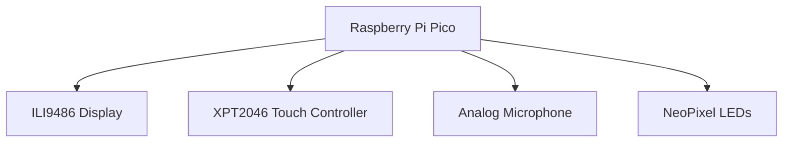
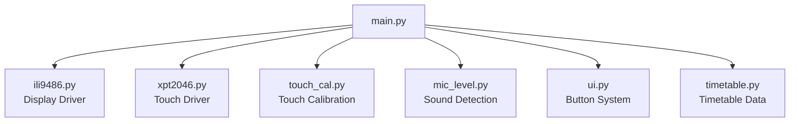

# Sunflower Lanyard Assistive Device

A wearable assistive support device built using a **Raspberry Pi Pico**, **ILI9486 touchscreen display**, and multiple sensors. The system is designed to attach to a **Sunflower lanyard** and provide accessible digital support tools such as communication cards, grounding exercises, timetable information, and environmental feedback.

This project explores how **low-cost embedded systems can be used to build practical accessibility tools** for people who benefit from assistive technology in everyday environments.

---

# Overview

The device provides a compact touchscreen interface that can be worn on a **Sunflower lanyard**, allowing the user to quickly access helpful tools from a portable embedded system.

The system currently includes:

* Communication cards for non-verbal communication
* Grounding exercises for stress regulation
* Personal contact information display
* School timetable viewer
* Accessible UI themes
* Ambient sound monitoring
* NeoPixel breathing LEDs for visual grounding
* Touchscreen navigation

The goal of the project is to explore how **embedded hardware combined with accessible interface design** can improve usability and support for people who experience sensory overload, communication barriers, or stressful environments.

---

# Key Features

## Touchscreen Interface

The device uses a **resistive touchscreen (XPT2046)** connected to a **480×320 ILI9486 display** to provide a menu-based interface. The UI uses large buttons and high-contrast colours to improve accessibility and usability.

Touch input is calibrated using configurable screen mapping values. 

---

## Communication Cards

The communication card system allows users to quickly display important messages when speaking may be difficult.

Cards are grouped into categories such as:

* Favourites
* Needs
* Sensory
* Responses
* Feelings

Example cards include:

* I NEED HELP
* PLEASE WAIT
* I NEED SPACE
* TOO LOUD
* I CAN'T SPEAK RIGHT NOW
* I FEEL OVERWHELMED

Cards can also trigger optional text-to-speech functionality in future versions.

---

## Grounding Tools

Several grounding techniques are built into the device to help regulate stress or anxiety.

Examples include:

* **5-4-3-2-1 sensory grounding**
* **Box breathing**
* **Body awareness grounding**

When the grounding screen is active, the device also activates **breathing LEDs** to visually guide slow breathing patterns. 

---

## Breathing LED System

A NeoPixel LED strip connected to **GPIO 10** performs a slow breathing animation synchronized with the grounding exercises.

The breathing pattern includes:

* inhale phase
* hold phase
* exhale phase
* rest phase

The LEDs automatically change colour depending on the environmental sound level.

---

## Ambient Sound Monitoring

An analog microphone connected to **ADC0 (GP26)** measures environmental noise levels.

The device displays a badge indicating whether the environment is:

* **QUIET OK**
* **LOUD**

The sound detection uses RMS amplitude smoothing and hysteresis to avoid rapid switching between states. 

---

## School Timetable Screen

A timetable screen allows the device to display scheduled classes or events.

The timetable data is stored in a simple dictionary structure inside `timetable.py`, making it easy to edit.

Example entry:

```
{
 "time": "10:00-11:00",
 "title": "Internet of Things Lecture",
 "room": "2B025"
}
```

Each weekday can contain multiple scheduled periods. 

---

## Contact Information Screen

The device can display important personal information such as:

* Name
* Pronouns
* Phone number
* Emergency contact
* Medical notes

This information can help others assist the user if needed.

---

## Accessible Themes

The interface supports multiple colour themes designed for accessibility, including:

* Dark high-contrast
* Light high-contrast
* Yellow accessibility theme
* Green accessibility theme
* Amber dark theme

Themes can be changed through the settings screen.

---

# Hardware Components

| Component          | Description                             |
| ------------------ | --------------------------------------- |
| Raspberry Pi Pico  | Microcontroller running the application |
| ILI9486 Display    | 480×320 SPI touchscreen display         |
| XPT2046 Controller | Resistive touch controller              |
| Analog Microphone  | Ambient noise detection                 |
| NeoPixel LEDs      | Breathing light indicator               |
| Sunflower Lanyard  | Wearable mounting system                |

---

# Hardware Wiring

## Core Connections

| Component      | Pico Pin |
| -------------- | -------- |
| Display MOSI   | GP19     |
| Display MISO   | GP16     |
| Display SCK    | GP18     |
| Display CS     | GP17     |
| Display DC     | GP20     |
| Display RESET  | GP21     |
| Touch CS       | GP15     |
| Touch IRQ      | GP14     |
| Microphone OUT | GP26     |
| NeoPixel Data  | GP10     |

---

## System Wiring Diagram



---

# Software Architecture

The project separates hardware drivers from UI logic.



---

# Repository Structure

```
sunflower-lanyard-device/

main.py
ili9486.py
xpt2046.py
touch_cal.py
mic_level.py
ui.py
timetable.py

README.md
```

---

# Installation

## Requirements

* Raspberry Pi Pico
* MicroPython firmware
* SPI touchscreen display
* Analog microphone module
* NeoPixel LED strip

---

## Install MicroPython

Download firmware:

[https://micropython.org/download/rp2-pico/](https://micropython.org/download/rp2-pico/)

Flash the Pico using **BOOTSEL mode**.

---

## Upload Project Files

Copy the project files onto the Pico:

```
main.py
ili9486.py
xpt2046.py
touch_cal.py
mic_level.py
ui.py
timetable.py
```

You can upload files using:

* Thonny
* rshell
* mpremote

---


# Future Development

Possible future improvements include:

* text-to-speech communication cards
* editable communication card creation
* Bluetooth phone integration
* battery powered wearable enclosure
* vibration alerts
* environmental noise logging
* icon-based UI navigation
* persistent user profiles

---

# Motivation

The **Sunflower lanyard** is widely recognised as a signal that someone may have a hidden disability and may require additional support or understanding.

This project explores how **embedded technology can extend that idea** by creating a wearable digital companion that supports communication, grounding, and accessibility in everyday environments.
