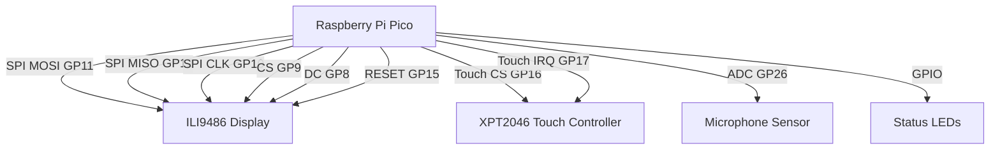
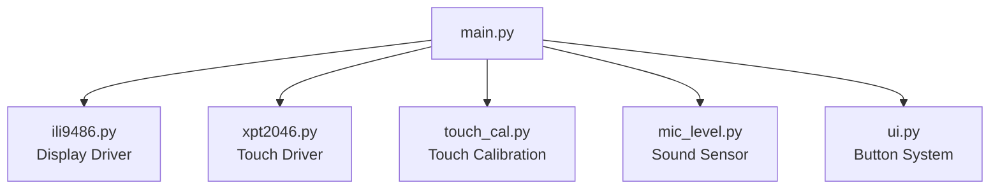
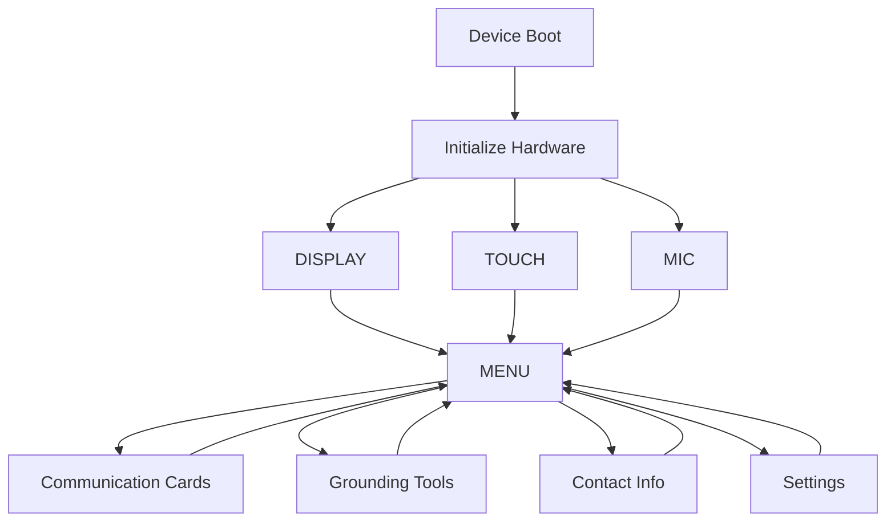

# Sunflower Lanyard Assistive Device

A wearable assistive support device built using a **Raspberry Pi Pico**, **touchscreen display**, and sensor modules. The system is designed to attach to a **Sunflower lanyard** and provide accessible digital support tools such as communication cards, grounding exercises, emergency contact information, and environmental feedback.

This project explores how **low-cost embedded systems** can be used to build practical accessibility tools that support users in public, social, or overwhelming environments.

---

# Overview

The device provides a compact touchscreen interface that can be worn on a **Sunflower lanyard**, allowing the user to quickly access helpful tools directly from a portable embedded system.

The system currently includes:

* Communication cards for non-verbal communication
* Grounding exercises for stress regulation
* Emergency contact information display
* Accessible UI themes with high contrast
* Environmental sound monitoring
* Touchscreen navigation

The goal of the project is to investigate how **embedded hardware combined with accessible interface design** can improve usability and support for people who benefit from assistive technology.

---

# Key Features

## Touchscreen Interface

The device uses a resistive touchscreen to navigate a menu-based interface with large buttons designed for accessibility and readability.

Users can switch between screens using simple touch interactions.

---

## Communication Cards

Communication cards allow users to display short messages quickly when speaking may be difficult.

Examples include:

* I NEED HELP
* PLEASE WAIT
* I NEED SPACE
* TOO LOUD
* I CANNOT SPEAK RIGHT NOW
* I FEEL OVERWHELMED

Large text ensures the message is visible to others.

---

## Grounding Tools

Several grounding techniques are available directly on the device.

These include:

* **5-4-3-2-1 sensory grounding**
* **Box breathing**
* **Body awareness grounding**

These tools can help support emotional regulation during stressful or overwhelming situations.

---

## Contact Information

The device can display important personal information such as:

* Name
* Pronouns
* Phone number
* Emergency contact
* Medical notes

This allows others to assist if necessary.

---

## Accessible Themes

The interface supports multiple visual themes designed for accessibility.

Examples include:

* Dark high-contrast
* Light high-contrast
* Yellow accessibility theme
* Green accessibility theme
* Amber theme

These themes improve readability in different environments.

---

## Environmental Sound Monitoring

The system uses an **analog microphone module** to detect ambient sound levels.

The UI displays whether the environment is:

* Quiet
* Loud

This can help users recognise when environments may become overwhelming.

---

# Hardware Components

| Component           | Description                             |
| ------------------- | --------------------------------------- |
| Raspberry Pi Pico   | Microcontroller running the application |
| ILI9486 Touchscreen | 480×320 SPI display used for UI         |
| XPT2046 Controller  | Resistive touch input controller        |
| Analog Microphone   | Detects environmental noise             |
| LEDs                | Optional visual indicators              |
| Sunflower Lanyard   | Wearable mounting system                |

---

# Hardware Wiring

## Wiring Table

| Component Pin  | Pico Pin    |
| -------------- | ----------- |
| MOSI           | GP11        |
| MISO           | GP12        |
| SCK            | GP10        |
| Display CS     | GP9         |
| Display DC     | GP8         |
| Display RESET  | GP15        |
| Touch CS       | GP16        |
| Touch IRQ      | GP17        |
| Microphone OUT | GP26 (ADC0) |
| Power          | 3.3V        |
| Ground         | GND         |

---

## Wiring Diagram



---

# User Interface

The UI is designed for **simplicity, accessibility, and quick interaction**.

Users navigate using large touchscreen buttons.

---

## Main Menu

Example layout:

```
+----------------------------------+
| Sunflower Support Device         |
| Quiet OK                         |
+----------------------------------+

[ Communication Cards ]
[ Grounding Tools      ]
[ Contact Info         ]
[ Settings             ]
```

---

## Communication Card Screen

```
+----------------------------------+
| COMMUNICATION CARD               |
+----------------------------------+

       I NEED HELP

+----------------------------------+
| BACK                             |
+----------------------------------+
```

---

## Grounding Screen

```
5-4-3-2-1 Grounding

5 things you see
4 things you feel
3 things you hear
2 things you smell
1 thing you taste
```

---

# Software Architecture



---

# Application Flow



---

# Installation

## Requirements

* Raspberry Pi Pico
* MicroPython firmware
* SPI touchscreen display
* Microphone module

---

## Install MicroPython

Download firmware:

[https://micropython.org/download/rp2-pico/](https://micropython.org/download/rp2-pico/)

Flash the Pico in **BOOTSEL mode**.

---

## Upload Project Files

Upload the project files to the Pico:

```
main.py
ili9486.py
xpt2046.py
touch_cal.py
mic_level.py
ui.py
```

You can upload using:

* Thonny
* mpremote
* rshell

# Repository Structure

```
sunflower-lanyard-device/

main.py
ili9486.py
xpt2046.py
mic_level.py
touch_cal.py
ui.py

docs/
images/

README.md
```

---

# Future Development

Potential future improvements include:

* Text-to-speech output
* Bluetooth phone companion app
* Battery powered enclosure
* Vibration alerts
* Environmental noise logging
* Larger icon-based UI
* User profiles

---

# Motivation

The **Sunflower lanyard** is widely recognised as a signal that someone may have a hidden disability and might require additional support.

This project explores how **embedded technology can extend that concept** by providing a wearable digital device that supports communication, grounding, and accessibility in everyday situations.
