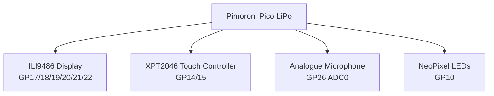
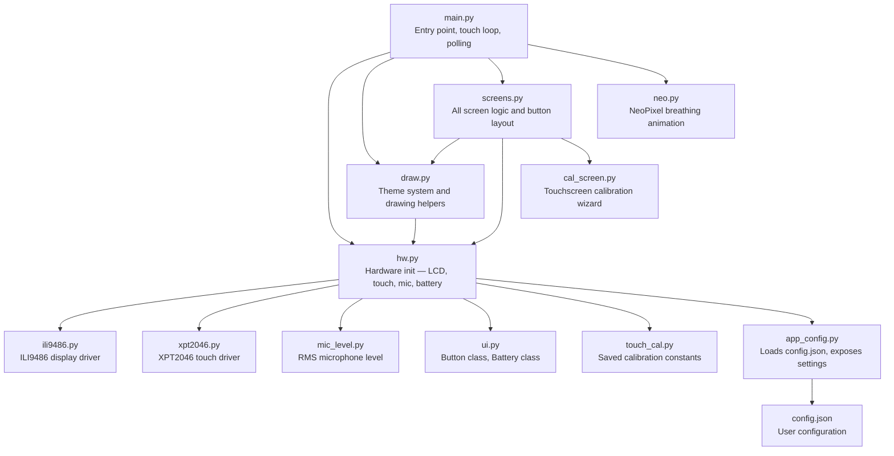

# Sunflower Lanyard Assistive Device

A wearable assistive support device built using a **Raspberry Pi Pico (Pimoroni Pico LiPo)**, **ILI9486 480×320 touchscreen display**, and multiple sensors. The system is designed to attach to a **Sunflower lanyard** and provide accessible digital support tools such as communication cards, grounding exercises, timetable information, and environmental feedback.

This project explores how **low-cost embedded systems can be used to build practical accessibility tools** for people who benefit from assistive technology in everyday environments.

---

# Overview

The device provides a compact touchscreen interface that can be worn on a **Sunflower lanyard**, allowing the user to quickly access helpful tools from a portable embedded system.

The system currently includes:

* Communication cards for non-verbal communication
* Grounding exercises for stress regulation
* Personal contact information display
* School timetable viewer
* Eight accessible UI colour themes
* Ambient sound monitoring with a live badge indicator
* NeoPixel breathing LEDs for visual grounding
* Battery level display
* Built-in touchscreen calibration wizard
* JSON-based configuration — no code changes needed for personal data

The goal of the project is to explore how **embedded hardware combined with accessible interface design** can improve usability and support for people who experience sensory overload, communication barriers, or stressful environments.

---

# Key Features

## Touchscreen Interface

The device uses a **resistive touchscreen (XPT2046)** connected to a **480×320 ILI9486 display** to provide a menu-based interface. The UI uses large buttons and high-contrast colours to improve accessibility and usability.

Touch input is calibrated using a built-in 4-point calibration wizard accessible from the settings screen. Calibration values are saved to `touch_cal.py` and persist across reboots.

---

## Communication Cards

The communication card system allows users to quickly display important messages when speaking may be difficult.

Cards are grouped into six categories:

* **Favourites** — most-used cards on one screen
* **Needs** — requests for help, space, breaks, water, and more
* **Sensory** — responses to sensory overload
* **Responses** — yes / no / maybe and short replies
* **Feelings** — emotional state cards
* **Status** — a simple green / amber / red traffic light

Example cards include:

* I NEED HELP
* PLEASE WAIT
* I NEED SPACE
* TOO LOUD
* I CAN'T SPEAK RIGHT NOW
* I FEEL OVERWHELMED

All card text, colours, and categories are configurable in `config.json`.

---

## Grounding Tools

Several grounding techniques are built into the device to help regulate stress or anxiety:

* **5-4-3-2-1 sensory grounding**
* **Box breathing**
* **Body awareness grounding**

When the grounding screen is active, the device activates **breathing LEDs** to visually guide slow breathing patterns.

---

## Breathing LED System

A NeoPixel LED strip connected to **GPIO 10** performs a slow breathing animation synchronised with the grounding exercises, implemented in `neo.py`.

The breathing pattern includes:

* Inhale phase (cosine ease-in)
* Hold phase
* Exhale phase (cosine ease-out)
* Rest phase

The LEDs automatically change colour depending on the ambient sound level — calm blue when quiet, purple when the environment is loud. Write rate is hard-throttled to avoid dominating the main loop.

---

## Ambient Sound Monitoring

An analogue microphone connected to **ADC0 (GP26)** measures environmental noise levels using RMS amplitude with exponential moving average smoothing.

The device displays a persistent badge on every screen indicating whether the environment is:

* **QUIET OK**
* **LOUD**

State switching uses hysteresis and a hold timer to avoid rapid flickering. The sensitivity threshold is adjustable live from the settings screen and saved to `config.json`.

---

## Battery Display

The device reads battery voltage from the **Pimoroni Pico LiPo** onboard ADC and displays a percentage indicator in the title bar. A charging indicator is shown when the USB cable is connected.

---

## School Timetable Screen

The timetable screen displays scheduled classes or events for the current week.

Timetable data is stored in `config.json` under a simple day-keyed structure, making it easy to edit without touching any code:

```json
"THU": [
  { "time": "13:30-15:00", "title": "advanced algorithms practical", "room": "3Q085" },
  { "time": "15:00-16:30", "title": "advanced algorithms lecture",   "room": "2D067" }
]
```

Each weekday can contain multiple scheduled periods.

---

## Contact Information Screen

The device displays important personal information including:

* Name and pronouns
* Phone number
* Emergency contact name, relationship, and phone
* Medical notes

All fields are set in `config.json`. This information can help others assist the user if needed.

---

## Accessible Themes

The interface supports eight colour themes selectable from the settings screen:

| Theme       | Description                            |
| ----------- | -------------------------------------- |
| NEON\_DARK  | High-contrast black with cyan and green |
| CREAM       | Warm light — soft peach buttons         |
| GLACIER     | Cool icy blue                           |
| NIGHT       | Deep navy for low-light environments    |
| SUNSET      | Warm orange and magenta                 |
| STEEL       | Neutral grey with cyan accents          |
| LAVENDER    | Soft purple — calming pastel            |
| MONO        | High-contrast black and white           |

---

## Built-in Calibration Wizard

The settings screen includes a **CAL** button that launches a 4-point touchscreen calibration wizard. The wizard displays crosshair targets at each corner of the screen, samples 16 raw touch readings per point, detects axis swap automatically, and extrapolates the raw-to-screen mapping to the full display edges. The result is saved as `touch_cal.py` and the device restarts automatically.

---

# Hardware Components

| Component             | Description                                      |
| --------------------- | ------------------------------------------------ |
| Pimoroni Pico LiPo    | RP2040 microcontroller with onboard battery management |
| ILI9486 Display       | 480×320 SPI touchscreen display                  |
| XPT2046 Controller    | Resistive touch controller                        |
| Analogue Microphone   | Ambient noise detection via ADC                  |
| NeoPixel LED strip    | Breathing light indicator (10 LEDs)              |
| Sunflower Lanyard     | Wearable mounting system                         |

---

# Hardware Wiring

## Core Connections

| Component       | Pico Pin |
| --------------- | -------- |
| Display MOSI    | GP19     |
| Display MISO    | GP16     |
| Display SCK     | GP18     |
| Display CS      | GP17     |
| Display DC      | GP20     |
| Display RESET   | GP21     |
| Display BL      | GP22     |
| Touch CS        | GP15     |
| Touch IRQ       | GP14     |
| Microphone OUT  | GP26 (ADC0) |
| NeoPixel DIN    | GP10     |

NeoPixels require a **330 Ω series resistor** on the data line, 5 V from VBUS, and GND.

---

## System Wiring Diagram



---

# Software Architecture

The project is split into focused modules with a strict one-way dependency hierarchy.



### Module responsibilities

| File            | Responsibility |
| --------------- | -------------- |
| `main.py`       | Main loop, touch polling, mic/battery polling, NeoPixel tick |
| `hw.py`         | One-time hardware initialisation; all other modules import objects from here |
| `draw.py`       | Theme definitions, shared display-state variables, all drawing helpers |
| `screens.py`    | Every screen, button layout, screen-switching logic |
| `neo.py`        | `BreathingPixels` class — self-contained, no project dependencies |
| `cal_screen.py` | 4-point calibration wizard; only imports `time` and `hw` |
| `app_config.py` | Loads `config.json` and exposes typed settings constants |
| `ili9486.py`    | Low-level ILI9486 SPI display driver |
| `xpt2046.py`    | Low-level XPT2046 resistive touch driver |
| `mic_level.py`  | ADC sampling, RMS, EMA smoothing, quiet/loud state machine |
| `ui.py`         | `Button` hit-test class, `Battery` voltage reader |
| `touch_cal.py`  | Auto-generated calibration constants (written by `cal_screen.py`) |
| `config.json`   | User-editable configuration: comm cards, timetable, contact info, mic thresholds |

---

# Repository Structure

```
sunflower-lanyard-device/

main.py           — entry point and main loop
hw.py             — hardware initialisation
draw.py           — theme system and drawing helpers
screens.py        — all screen and button logic
neo.py            — NeoPixel breathing animation
cal_screen.py     — touchscreen calibration wizard

app_config.py     — configuration loader
config.json       — user configuration (comm cards, timetable, contact)

ili9486.py        — ILI9486 display driver
xpt2046.py        — XPT2046 touch driver
mic_level.py      — microphone RMS level detector
ui.py             — Button and Battery classes
touch_cal.py      — saved calibration constants (auto-generated)

README.md
```

---

# Installation

## Requirements

* Pimoroni Pico LiPo (or standard Raspberry Pi Pico)
* MicroPython firmware
* ILI9486 480×320 SPI touchscreen with XPT2046 touch controller
* Analogue microphone module
* NeoPixel LED strip (10 LEDs)

---

## Install MicroPython

Download the Pimoroni MicroPython firmware (includes battery ADC support):

[https://github.com/pimoroni/pimoroni-pico/releases](https://github.com/pimoroni/pimoroni-pico/releases)

Or use standard MicroPython if not using a Pimoroni board:

[https://micropython.org/download/rp2-pico/](https://micropython.org/download/rp2-pico/)

Flash using **BOOTSEL mode**.

---

## Upload Project Files

Copy all project files to the root of the Pico:

```
main.py
hw.py
draw.py
screens.py
neo.py
cal_screen.py
app_config.py
config.json
ili9486.py
xpt2046.py
mic_level.py
ui.py
touch_cal.py
```

You can upload files using **Thonny**, **rshell**, or **mpremote**.

---

## First Run and Calibration

On first boot the device will start using the default `touch_cal.py` calibration values. If touch accuracy is poor:

1. Open **Settings** from the dashboard
2. Tap the **CAL** button in the navigation bar
3. Follow the on-screen instructions — tap each crosshair in order
4. The device saves the calibration and restarts automatically

---

## Editing Configuration

All personal data, communication cards, and timetable entries are stored in `config.json`. Edit this file directly and re-upload it to the Pico. The device falls back to built-in defaults if the file is missing or cannot be parsed.

Key configurable sections:

| Section           | Contents |
| ----------------- | -------- |
| `contact`         | Name, pronouns, phone, emergency contact, medical notes |
| `timetable`       | Weekly schedule by day |
| `comm_cards`      | All communication card categories and phrases |
| `mic_quiet_thresh`| RMS threshold for quiet/loud detection |
| `mic_hysteresis`  | Hysteresis band to prevent rapid switching |
| `mic_quiet_hold_ms` | How long quiet must persist before switching state |

---

# Future Development

Possible future improvements include:

* Text-to-speech for communication cards
* Editable communication card creation on-device
* Bluetooth phone integration
* Vibration alerts for sensory-friendly notifications
* Environmental noise logging
* Icon-based UI navigation
* Persistent user profiles

---

# Motivation

The **Sunflower lanyard** is widely recognised as a signal that someone may have a hidden disability and may require additional support or understanding.

This project explores how **embedded technology can extend that idea** by creating a wearable digital companion that supports communication, grounding, and accessibility in everyday environments.
